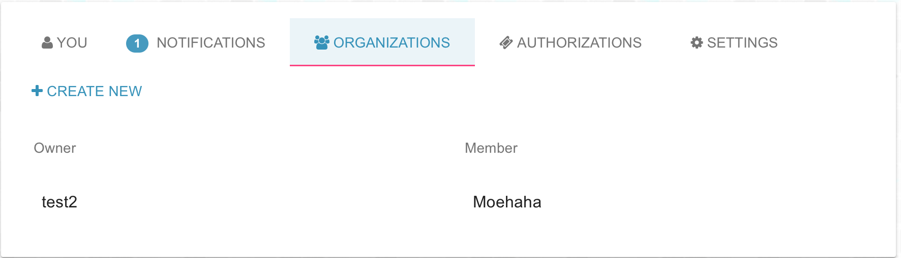
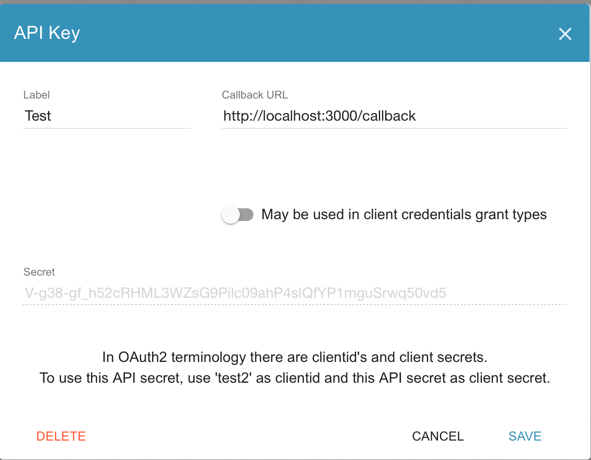

## How it works

- [Get the OAuth Access Code](#get-access-code)
- [Get the JSON Web Token](#get-jwt)

<a id="get-access-code"></a>
### Get the OAuth Access Code

Installation details : [https://www.gitbook.com/book/gig/itsyouonline/details](https://www.gitbook.com/book/gig/itsyouonline/details).

To start we create a new Node.js express app in Webstorm (or other IDE'S).

First we take a look at the given Authorization code link:

`https://itsyou.online/v1/oauth/authorize?response_type=code&client_id=CLIENT_ID&redirect_uri=CALLBACK_URL&scope=read&state=STATE`

The **CLIENT_ID** stands for the name of the organization as which you signed up on ItsYou.online.

In this example we use Test2.



So we create a constant in our program called CLIENT_ID, you can also make this environment variables that you can export(change value) in the command line.

```java
const CLIENT_ID = "test2";
```

Next the **redirect uri** is equal to the callback address you choose, in this case we are going to loopback to a localhost (address can be chosen freely).
So again we create a variable called callBack which we set to:

```java
var callBack = "http://localhost:3000/callback";
```

The scope is the actual data you want to fetch from ItsYou.online, take a quick look here:

`https://gig.gitbooks.io/itsyouonline/content/oauth2/scopes.html`

In this example we want all the information that the user has.
So the scope will look something like this:

```java
var SCOPE = "user:name,user:email:user,user:facebook,user:address:main,user:phone:main,user:bankaccount:main,user:github"
```

Next we generate a **random state** (security reasons), we store it in our session and then we render the login page by referring to the login url.

```java
var loginUrl = 'https://itsyou.online/v1/oauth/authorize?response_type=code&client_id=' + CLIENT_ID
        + '&redirect_uri=' + callBack
        + '&scope=' + SCOPE
        + '&state=' + state
    res.render('index', {
            loginUrl: loginUrl
        }
    );
```

Next you will have to login to ItsYou.online and you need to give permission as user on which information you wish to share (the information asked from the user depends on the scope).
At this moment, the user will get an access token which will be used in the following steps.


<a id="get-jwt"></a>
### Get the JSON Web Token

The first thing you want to look up is the **client secret**, this is shown when when you make a new company.



Next you make a new file to write the code for implementing the callback. Declare a variable which holds the secret and a variable which is the callback URL.

```java
var client_secret = "V-g38-gf_h52cRHML3WZsG9Pilc09ahP4sIQfYP1mguSrwq50vd5"
var redirect_uri = "http://localhost:3000/callback"
```

Also check if the state in our session is still the same as the current state.

It's important that you make a POST request to:

```
https://itsyou.online/v1/oauth/access_token?client_id=CLIENT_ID&client_secret=CLIENT_SECRET&code=AUTHORIZATION_CODE&redirect_uri=CALLBACK_URL&state=STATE
```

When all the values are filled in correctly you will get a response with the access token that will look something like this:

```json
{"access_token":"ACCESS_TOKEN","token_type":"bearer","expires_in":86400,"refresh_token":"REFRESH_TOKEN","scope":"read","info":{"username":"bob"}}
```

Now the application is authorized. It may use the token to access the user's account via the service API, limited to the scope of access, until the token expires or is revoked. If a refresh token was issued, it may be used to request new access tokens if the original token has expired.

The access token allows you to make requests to the API on a behalf of a user:

`GET https://itsyou.online/api/users/bob/info?access_token=...`

You can pass the token in the query params like shown above, but a cleaner approach is to include it in the Authorization header:

`Authorization: token OAUTH-TOKEN`

For example, in curl you can set the Authorization header like this:

`curl -H "Authorization: token OAUTH-TOKEN"`

If you make a GET request to https://itsyou.online/api/users/"accessToken.info.username"/info you will get JSON data in response in which you can pull out all the data you want to use.
